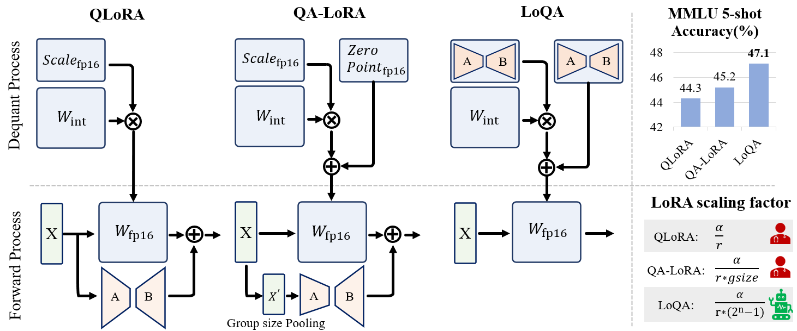

# LoQA
<div align="center">
  
</div>
Low rank Quantization Adaptation (LoQA) is a novel approach that effectively fine-tunes holistic quantization parameters. 

## Installation
```bash
conda create -n loqa python=3.8
conda activate loqa
conda install pytorch==2.2.0 torchvision==0.17.0 torchaudio==2.2.0 pytorch-cuda=12.1 -c pytorch -c nvidia
cd AutoGPTQ 
pip install -e .
cd ..
pip install bitsandbytes
pip install -r requirements.txt
pip install protobuf==3.20.*
pip uninstall triton
```

## Quantization
We use "./AutoGPTQ/examples/quantization/basic_usage_wikitext2.py" for quantization.
For example, you can use:
```bash
python basic_usage_wikitext2.py --bits 4 -group_size 32 --pretrained_model_dir <model_path> --quantized_model_dir <save_path>
```
If you change the group-size, you need to change the group_size in `./AutoGPTQ/auto_gptq/utils/peft_utils.py` accordingly.


## Training
```bash
./scripts/run_loqa.sh
```

